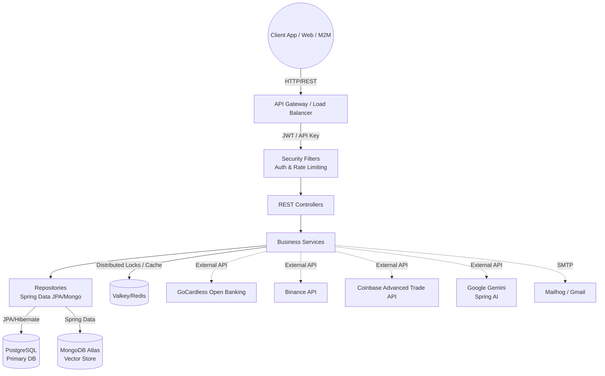

# NexaBudget Backend - System Architecture

## 1. System Overview

NexaBudget is a comprehensive personal finance management application. The backend service is designed as a robust RESTful API built on **Java 25** and **Spring Boot 4.0.5**. It adopts a strict layered architecture pattern, optimizing for high scalability, secure data handling, and seamless integration with modern external systems like AI (Google Gemini) and Open Banking (GoCardless).

## 2. Technology Stack

* **Core Framework:** Java 25, Spring Boot 4.0.5
* **Relational Database:** PostgreSQL (Primary storage for Users, Accounts, Transactions, Budgets, etc.)
* **Vector Database:** MongoDB Atlas (Utilized for AI semantic caching and vector embeddings)
* **Caching & Distributed Coordination:** Valkey / Redis via Redisson (Used for caching bank data, crypto pricing, and distributed locking)
* **AI Integration:** Google Gemini via Spring AI (Handles transaction categorization, financial analysis, and chatbot functionalities)
* **Security:** Spring Security (Stateless JWT for user sessions, API Keys for M2M communication, bcrypt for passwords)
* **Crypto Integrations:** Binance Spot API, Coinbase Advanced Trade API
* **Build, Deployment & Containerization:** Maven, Docker, GraalVM Native Image, Kubernetes (Kustomize)

## 3. Core Architectural Patterns

The application strictly adheres to a standard 4-tier RESTful architecture, ensuring separation of concerns:

1. **Presentation Layer (Controllers):**
   - Handles incoming HTTP requests and responses.
   - Performs basic input validation using Bean Validation (`@Valid`).
   - Maps incoming JSON payloads to Data Transfer Objects (DTOs) and vice versa, keeping the domain models isolated from the API contract.
2. **Business Layer (Services):**
   - Contains the core business rules and logic.
   - Orchestrates transactions (`@Transactional`).
   - Interacts with external APIs (GoCardless, Binance, Coinbase, Gemini) and abstracts their complexities.
3. **Data Access Layer (Repositories):**
   - Utilizes Spring Data JPA interfaces for PostgreSQL interactions.
   - Utilizes Spring Data MongoDB interfaces for vector operations.
   - Handles complex queries, pagination, and data retrieval.
4. **Domain Layer (Models/Entities):**
   - JPA annotated POJOs (`@Entity`, `@Table`) representing the database schema.
   - Uses UUIDs as primary keys to ensure global uniqueness and prevent enumeration attacks.

## 4. High-Level Architectural Diagram

## 5. Detailed Component Architecture

### 5.1 Concurrency & Virtual Threads

Spring Boot 4.x running on Java 25 leverages **Virtual Threads** (Project Loom). Enabled via `spring.threads.virtual.enabled=true`, it allows the backend to handle a massive number of concurrent requests with minimal memory overhead. Blocking I/O operations (like database queries or external API calls to GoCardless/Gemini) no longer block platform threads, significantly increasing throughput.

### 5.2 Asynchronous Processing & Background Jobs

Long-running tasks are offloaded from the main request thread to avoid timeouts and improve UX:

- **Bulk Transaction Sync:** Synchronizing thousands of bank transactions via GoCardless is executed asynchronously (`@Async`).
- **AI Report Generation:** Generating a comprehensive PDF report via Gemini takes time. The request initiates a background job and returns a status ID. The client can poll for the report status.
- **Scheduled Tasks:** Jobs running via `@Scheduled` to purge soft-deleted items (older than 30 days) and warm up caches.

### 5.3 Distributed Coordination & Caching (Valkey/Redis)

Redisson is used to interface with a Redis/Valkey instance, fulfilling two critical roles:

- **Caching:** Application performance is boosted by caching frequent but slow operations, such as pulling current exchange rates or live crypto prices (e.g., cached for 5 minutes).
- **Distributed Locks:** To prevent race conditions (e.g., a user triggering a GoCardless bank sync multiple times concurrently), Redisson provides atomic locks (`isSynchronizing` flag) at the database/user level.

### 5.4 Cross-Cutting Concerns (AOP & Filters)

Aspect-Oriented Programming (AOP) and Servlet Filters are used to cleanly implement system-wide behaviors:

- **Audit Logging:** An `AuditAspect` automatically intercepts write/update/delete operations on core entities and logs them into the `audit_logs` table, tracking `who` did `what` and `when`.
- **Soft Deletes:** Deletions for critical data (`Account`, `Transaction`) don't actually drop the record. A `@SQLRestriction("deleted = false")` on the entity ensures they are hidden globally. A dedicated trash service allows for restoration.
- **Exception Handling:** A `@RestControllerAdvice` (`GlobalExceptionHandler`) intercepts all unhandled exceptions (e.g., `EntityNotFoundException`, `IllegalArgumentException`) and formats them into a standardized JSON error response.
- **Logging Filter:** Intercepts incoming requests and outgoing responses to log execution time, correlation IDs (`requestId`), and user context.

## 6. External Integrations Workflow

### 6.1 Open Banking (GoCardless)

1. **Link Initiation:** The user requests to link a bank. The backend calls GoCardless to create a requisition and returns a link.
2. **User Consent:** The user completes the flow on the bank's page.
3. **Synchronization:** NexaBudget fetches accounts and transactions. Data is sanitized, duplicated entries are prevented, and amounts are converted if the currency differs from the primary account setting.

### 6.2 AI Engine (Google Gemini)

The system leverages `spring-ai-google-genai` for deeply integrated intelligent features:

- **Auto-Categorization:** New unclassified transactions are sent to Gemini with a predefined prompt to determine the most probable category.
- **Semantic Caching:** To avoid asking the AI the same questions or categorizing identical transactions repeatedly, queries are embedded (`gemini-embedding-001`) and stored in MongoDB Atlas. Before a Gemini call, the system performs a vector similarity search in Mongo to return cached responses.
- **Conversational Chatbot:** The `ChatController` maintains conversation history, allowing the user to interactively query their financial data.

### 6.3 Crypto Portfolio (Binance + Coinbase)

The system calls the Binance Spot API and the Coinbase Advanced Trade API using encrypted read-only credentials stored in PostgreSQL. Symmetrical encryption (AES) guarantees keys remain secure at rest. Live balances are fetched, matched with real-time cached pricing, and presented in the unified portfolio.

## 7. Data Flow Example: Creating a Transaction

1. **Client Request:** `POST /api/transactions` with JSON payload (DTO).
2. **Security Filter:** `JwtAuthenticationFilter` validates the token and sets the `SecurityContext`.
3. **Controller:** `TransactionController` validates the DTO and passes it to the `TransactionService`.
4. **Service Logic:** 
   - Fetches the associated `Account` and `Category`.
   - Validates ownership (does this account belong to the logged-in user?).
   - If multi-currency, calls `CurrencyConversionService` to normalize the amount.
5. **Persistence:** Saves the new `Transaction` entity via `TransactionRepository`.
6. **AOP Interceptor:** `AuditAspect` fires in the background, creating an `AuditLog` entry.
7. **Budget Alert Check:** Triggers an async event to check if the new transaction breached any `BudgetAlert` thresholds. If yes, an email is queued.
8. **Response:** Controller returns the saved transaction mapped back to a DTO with `201 Created`.

## 8. Deployment Architecture

* **Containerization:** The application can be run in a standard JVM container or compiled down to a GraalVM Native Image for ultra-fast startup and low memory usage.
* **Orchestration:** Designed to be stateless (session state is entirely client-side via JWT, coordination via Redis), making it perfectly suited for horizontal scaling in Kubernetes.
