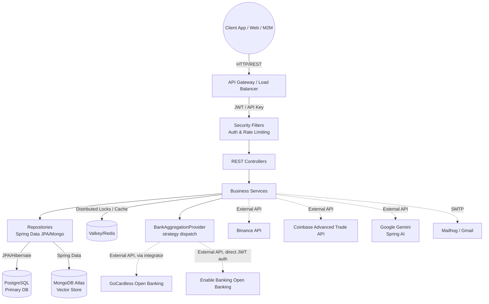

# NexaBudget Backend - System Architecture

## 1. System Overview

NexaBudget is a comprehensive personal finance management application. The backend service is designed as a robust RESTful API built on **Java 25** and **Spring Boot 4.0.5**. It adopts a strict layered architecture pattern, optimizing for high scalability, secure data handling, and seamless integration with modern external systems like AI (Google Gemini) and Open Banking (GoCardless, Enable Banking).

## 2. Technology Stack

* **Core Framework:** Java 25, Spring Boot 4.0.5
* **Relational Database:** PostgreSQL (Primary storage for Users, Accounts, Transactions, Budgets, etc.)
* **Vector Database:** MongoDB Atlas (Utilized for AI semantic caching and vector embeddings)
* **Caching:** Valkey / Redis via Spring Data Redis (Lettuce client) and Spring Cache abstraction (used for exchange rates, crypto pricing, GoCardless metadata, async-job status)
* **AI Integration:** Google Gemini via Spring AI (Handles transaction categorization, financial analysis, and chatbot functionalities)
* **Security:** Spring Security (stateless JWT via `jjwt 0.13`, API Keys for M2M, BCrypt for passwords, Bucket4j-based per-IP rate limiting on auth endpoints). `jjwt` is also used server-side to sign the RS256 application JWTs required by the Enable Banking Cloud API — a separate concern from user session auth.
* **PDF Generation:** OpenPDF 1.3.32 for AI report rendering
* **CSV Parsing:** Apache Commons CSV 1.12 for transaction import
* **Crypto Integrations:** Binance Spot API, Coinbase Advanced Trade API
* **Build, Deployment & Containerization:** Maven, Docker, GraalVM Native Image, Kubernetes (Kustomize)

## 3. Core Architectural Patterns

The application strictly adheres to a standard 4-tier RESTful architecture, ensuring separation of concerns:

1. **Presentation Layer (Controllers):**
   - Handles incoming HTTP requests and responses.
   - Performs basic input validation using Bean Validation (`@Valid`).
   - Maps incoming JSON payloads to Data Transfer Objects (DTOs) and vice versa, keeping the domain models isolated from the API contract.
2. **Business Layer (Services):**
   - Contains the core business rules and logic.
   - Orchestrates transactions (`@Transactional`).
   - Interacts with external APIs (GoCardless, Enable Banking, Binance, Coinbase, Gemini) and abstracts their complexities.
3. **Data Access Layer (Repositories):**
   - Utilizes Spring Data JPA interfaces for PostgreSQL interactions.
   - Utilizes Spring Data MongoDB interfaces for vector operations.
   - Handles complex queries, pagination, and data retrieval.
4. **Domain Layer (Models/Entities):**
   - JPA annotated POJOs (`@Entity`, `@Table`) representing the database schema.
   - Uses UUIDs as primary keys to ensure global uniqueness and prevent enumeration attacks.

## 4. High-Level Architectural Diagram

## 5. Detailed Component Architecture

### 5.1 Concurrency & Virtual Threads

Spring Boot 4.x running on Java 25 leverages **Virtual Threads** (Project Loom). Enabled via `spring.threads.virtual.enabled=true`, it allows the backend to handle a massive number of concurrent requests with minimal memory overhead. Blocking I/O operations (like database queries or external API calls to GoCardless/Gemini) no longer block platform threads, significantly increasing throughput.

### 5.2 Asynchronous Processing & Background Jobs

Long-running tasks are offloaded from the main request thread to avoid timeouts and improve UX:

- **Bulk Transaction Sync:** Synchronizing thousands of bank transactions via GoCardless is executed asynchronously (`@Async`).
- **AI Report Generation:** Generating a comprehensive financial-analysis report via Gemini takes time. `POST /api/reports/ai-analysis` enqueues a background job and returns a `jobId`; the client polls `GET /api/reports/ai-analysis/{jobId}` until completion. The transactions dataset is attached as a real multipart `.csv` file (Spring AI Media Attachment), not concatenated into the prompt text. Final report is rendered to PDF via OpenPDF.
- **Bulk Categorization:** `BulkCategorizationService` runs AI auto-categorization in batches with a configurable timeout (`NEXABUDGET_BULK_CATEGORIZATION_TIMEOUT_SECONDS`, default 120 s).
- **Scheduled Tasks (`@EnableScheduling` on `AsyncConfig`):**
   - Budget template instantiation — `0 0 1 1 * ?` (1 AM on the 1st of every month)
   - Budget alert evaluation — `fixedRate = 3_600_000` (hourly)
   - Trash purge — `0 0 3 * * ?` (daily at 03:00, hard-deletes items older than 30 days)

### 5.3 Caching & Concurrency Control

The application uses **Spring Cache backed by Spring Data Redis (Lettuce client)** against a Valkey/Redis instance:

- **Caching:** Frequent but slow operations are cached — default TTL 6h for most caches and 5m for crypto prices. `CacheWarmupRunner` pre-populates the exchange-rate cache (USD → EUR/GBP) at startup. Cached methods use `unless` conditions to avoid caching empty fallback results, so retries are not blocked. Async AI-report job status is also tracked through cached entries.
- **Concurrency control on GoCardless sync:** Race conditions are prevented by a **database-level atomic lock**, not a Redis lock: `AccountService.tryAcquireSyncLock()` calls `AccountRepository.markSynchronizing()`, a JPQL `UPDATE accounts SET is_synchronizing = true WHERE id = :id AND is_synchronizing = false`. The row count returned tells the caller whether it acquired the lock.

### 5.3.1 Bank Aggregation Strategy Pattern

Bank account linking and transaction sync are abstracted behind a provider-agnostic
`service.bank.BankAggregationProvider` interface (`getInstitutions`, `startLink`, `completeLink`,
`getProviderAccounts`, `fetchTransactions`), so `AccountService` never talks to a provider SDK
directly:

- `GocardlessAggregationProvider` — thin adapter over the pre-existing `GocardlessService` (which
  itself calls the external `gocardless-integrator` microservice; unchanged by this pattern).
- `EnableBankingAggregationProvider` — wraps `EnableBankingService`, which calls Enable Banking's
  Cloud API directly (JWT RS256, no intermediary — see [ENABLE_BANKING_SETUP.md](ENABLE_BANKING_SETUP.md)).

`AccountService` holds a `Map<BankProvider, BankAggregationProvider>`, built from every registered
implementation bean, and dispatches on `Account.provider` (enum `GOCARDLESS` / `ENABLE_BANKING`,
nullable — `null` means a manual, never-linked account). `Account.requisitionId` and
`Account.externalAccountId` are intentionally generic, provider-agnostic columns: GoCardless stores
its requisition id / provider account id there, Enable Banking stores its `session_id` / account
`uid`. Both `syncAccountTransactions()` (lock acquisition, 6-hour freshness guard, balance
alignment, `requiresReauth` handling) and the transaction-import/dedup path are fully
provider-agnostic, operating on a normalized `NormalizedBankTransaction` DTO that each provider
adapter produces from its own wire format.

The two providers differ in **link topology**: GoCardless completes a link via polling
(`getProviderAccounts`), while Enable Banking requires an explicit `completeLink` step exchanging
an OAuth-style `code` for a session — see [API_GUIDE.md](API_GUIDE.md#bank-aggregation-gocardless--enable-banking).

### 5.4 Cross-Cutting Concerns (AOP & Filters)

Aspect-Oriented Programming (AOP) and Servlet Filters are used to cleanly implement system-wide behaviors:

- **Audit Logging:** An `AuditAspect` automatically intercepts write/update/delete operations on core entities and logs them into the `audit_logs` table, tracking `who` did `what` and `when`.
- **Soft Deletes:** Deletions for critical data (`Account`, `Transaction`) don't actually drop the record. A `@SQLRestriction("deleted = false")` on the entity ensures they are hidden globally. A dedicated trash service allows for restoration.
- **Exception Handling:** A `@RestControllerAdvice` (`GlobalExceptionHandler`) intercepts all unhandled exceptions (e.g., `EntityNotFoundException`, `IllegalArgumentException`) and formats them into a standardized JSON error response.
- **Logging Filter:** `LoggingFilter` intercepts incoming requests and outgoing responses to log execution time and inject correlation IDs (`requestId`) and user context into the MDC. The log pattern includes `[%X{requestId}] [%X{username}]`.
- **Rate Limiting:** `RateLimitingFilter` (Bucket4j token bucket per client IP) protects authentication endpoints from brute-force. Configurable via `security.rate-limit.requests-per-minute` (default `10`) and `security.rate-limit.enabled`.
- **Resilience:** Spring Retry (`@EnableRetry` on `AsyncConfig`) decorates GoCardless, Enable Banking, and ExchangeRate calls with `@Retryable(retryFor = RestClientException.class, maxAttempts = 3, backoff = 1s × 2)`. HTTP timeouts: GoCardless 5 s / 10 s, Enable Banking 5 s / 10 s, Binance 5 s / 5 s, ExchangeRate 5 s / 5 s. A recurring gotcha with this stack: any `@Retryable` method that has an `@Recover` also requires a matching `@Recover` overload for any custom checked-style exception thrown from it (e.g. `GocardlessRequisitionExpiredException`, `BankReauthRequiredException`) — otherwise Spring Retry masks it with `ExhaustedRetryException: Cannot locate recovery method`. Both `GocardlessService` and `EnableBankingService` include a dedicated rethrow-only `@Recover` for this reason.

## 6. External Integrations Workflow

### 6.1 Open Banking — GoCardless + Enable Banking

Both providers converge on the same conceptual flow, dispatched through the
`BankAggregationProvider` strategy described in §5.3.1:

1. **Link Initiation:** The user picks a provider and a bank. The backend asks that provider to
   start a consent flow and returns a redirect URL.
   - GoCardless: creates a requisition via the `gocardless-integrator` microservice.
   - Enable Banking: calls `POST /auth` directly on `api.enablebanking.com` with a JWT signed
     in-app; `state` carries the local `accountId` so the (single, static) callback route can
     identify which account the flow belongs to.
2. **User Consent:** The user completes the flow on the bank's page and is redirected back.
   - GoCardless: the frontend polls `GET /api/banking/gocardless/{id}/accounts` until linked.
   - Enable Banking: the frontend's callback page extracts `code`/`state` from the query string and
     calls `POST /api/banking/enable-banking/{id}/session` to exchange the code for a session.
3. **Synchronization:** NexaBudget fetches accounts and transactions through the resolved provider
   adapter, normalizes them into `NormalizedBankTransaction`, and imports via the shared,
   provider-agnostic dedup/import path in `TransactionService`. Duplicated entries are prevented
   (externalId scoped per account), and amounts are converted if the currency differs from the
   primary account setting.

See [ENABLE_BANKING_SETUP.md](ENABLE_BANKING_SETUP.md) for registering an Enable Banking
application, generating the RSA key pair, and required environment variables.

### 6.2 AI Engine (Google Gemini)

The system leverages `spring-ai-google-genai` for deeply integrated intelligent features:

- **Auto-Categorization:** New unclassified transactions are sent to Gemini with a predefined prompt to determine the most probable category.
- **Semantic Caching:** To avoid asking the AI the same questions or categorizing identical transactions repeatedly, queries are embedded (`gemini-embedding-001`) and stored in MongoDB Atlas. Before a Gemini call, the system performs a vector similarity search in Mongo to return cached responses.
- **Conversational Chatbot:** The `ChatController` maintains conversation history, allowing the user to interactively query their financial data.

### 6.3 Crypto Portfolio (Binance + Coinbase)

The system calls the Binance Spot API and the Coinbase Advanced Trade API using encrypted read-only credentials stored in PostgreSQL. Symmetrical encryption (AES) guarantees keys remain secure at rest. Live balances are fetched, matched with real-time cached pricing, and presented in the unified portfolio.

## 7. Data Flow Example: Creating a Transaction

1. **Client Request:** `POST /api/transactions` with JSON payload (DTO).
2. **Security Filter:** `JwtAuthenticationFilter` validates the token and sets the `SecurityContext`.
3. **Controller:** `TransactionController` validates the DTO and passes it to the `TransactionService`.
4. **Service Logic:** 
   - Fetches the associated `Account` and `Category`.
   - Validates ownership (does this account belong to the logged-in user?).
   - If multi-currency, calls `CurrencyConversionService` to normalize the amount.
5. **Persistence:** Saves the new `Transaction` entity via `TransactionRepository`.
6. **AOP Interceptor:** `AuditAspect` fires in the background, creating an `AuditLog` entry.
7. **Budget Alert Check:** Triggers an async event to check if the new transaction breached any `BudgetAlert` thresholds. If yes, an email is queued.
8. **Response:** Controller returns the saved transaction mapped back to a DTO with `201 Created`.

## 8. Deployment Architecture

* **Containerization:** The application can be run in a standard JVM container or compiled down to a GraalVM Native Image for ultra-fast startup and low memory usage.
* **Orchestration:** Designed to be stateless (session state is entirely client-side via JWT, coordination via Redis), making it perfectly suited for horizontal scaling in Kubernetes.
