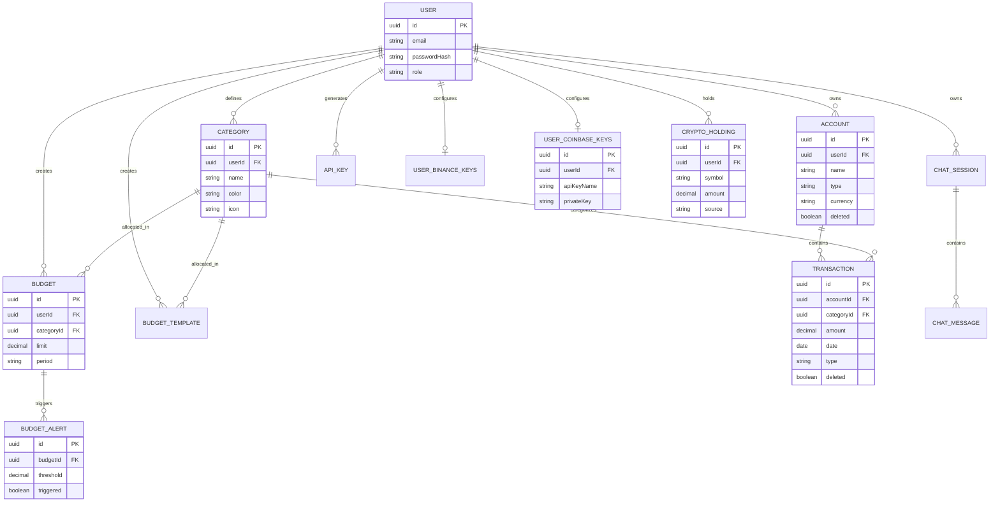

# Data Model and Database Schema

## Overview

NexaBudget utilizes **PostgreSQL** as its primary relational data store. The schema is designed around JPA entities with UUIDs as primary keys. 

### Key Design Principles:

* **UUIDs:** All entities use `UUID` for primary keys.
* **Soft Deletion:** `Account` and `Transaction` use soft deletion (`deleted = false`).
* **Auditing:** Every modification is tracked in `AuditLog`.
* **Crypto Sources:** Holdings track provenance via `source` (MANUAL, BINANCE, COINBASE).

## Entity Relationship Diagram

## Vector Store (MongoDB Atlas)

In addition to PostgreSQL, **MongoDB Atlas** is used specifically for the **Semantic Cache**.

* **Collection:** `semantic_cache`
* **Purpose:** Stores vector embeddings generated by Gemini to cache similar AI queries, reducing API costs and latency.
