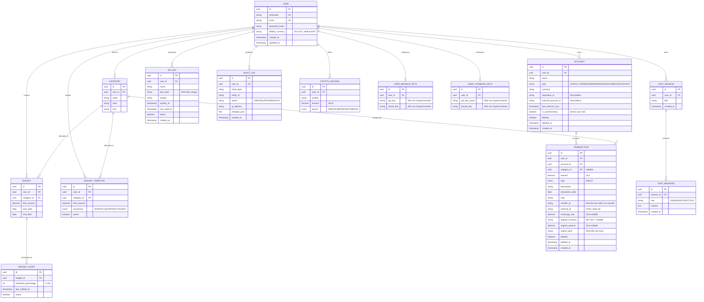

# Data Model and Database Schema

## Overview

NexaBudget uses **PostgreSQL** as its primary relational data store. The schema is generated from JPA entities (Hibernate) with UUID primary keys. In production `spring.jpa.hibernate.ddl-auto=validate` is enforced — every schema change must ship as an explicit DB migration script (see CLAUDE.md "New DB columns" sections).

### Key Design Principles

* **UUIDs everywhere:** All entities use `UUID` for primary keys (`@GeneratedValue(strategy = GenerationType.UUID)`) — prevents enumeration attacks.
* **Soft deletion:** `Account` and `Transaction` carry `deleted BOOLEAN` + `deleted_at TIMESTAMP`. The entity classes are annotated with `@SQLRestriction("deleted = false")` so soft-deleted rows are invisible to ordinary queries. Hard deletion is reserved for the `TrashService` purge job (>30 days) and for test teardown helpers (`*Repository.hardDeleteAll()`).
* **Net category accounting:** `Category` has **no** `transactionType` column. Budget spend on a category is computed as `OUT − IN` over the period (`TransactionRepository.sumNetByUserAndCategoryAndDateRange()`). The unique constraint on `categories` is `(user_id, name)`.
* **Auditing:** `AuditAspect` writes one `audit_logs` row per intercepted service write (user resolved from `SecurityContextHolder`, IP from `RequestContextHolder`).
* **Multi-currency:** `transactions.exchange_rate`, `original_currency`, `original_amount` capture the FX conversion applied when source/destination accounts differ in currency.
* **Import dedup:** `transactions.import_hash` stores SHA-256 of `(accountId|date|amount|description)`; combined with `external_id` (FITID) it prevents duplicate ingestion of CSV/OFX rows.
* **Indexes:** `transactions(user_id, transaction_date)`, `transactions(account_id, transaction_date)`, `transactions(category_id)`, `budgets(user_id, start_date, end_date)`, `api_keys(key_hash)`, `api_keys(user_id)`.

## Entity Relationship Diagram

> Note: column names in the diagram reflect the JPA `@Column(name = …)` mapping; some Java fields use camelCase (e.g. `limitAmount`, `lastNotifiedAt`).

## Enumerations

| Enum | Values |
| :--- | :--- |
| `AccountType` | `CONTO_CORRENTE`, `RISPARMIO`, `INVESTIMENTO`, `CONTANTI` |
| `TransactionType` | `IN`, `OUT` (signed convention: net = OUT − IN) |
| `HoldingSource` | `MANUAL`, `BINANCE`, `COINBASE` |
| `RecurrenceType` | `MONTHLY`, `QUARTERLY`, `YEARLY` |

## Vector Store (MongoDB Atlas)

MongoDB Atlas hosts the **semantic cache** for AI calls, configured via `spring.ai.vectorstore.mongodb.*`.

* **Collection:** `semantic_cache` (configurable via `SEMANTIC_CACHE_COLLECTION_NAME`)
* **Atlas Vector Search index:** `semantic_cache_index` (configurable via `SEMANTIC_CACHE_INDEX_NAME`)
* **Embedding model:** `gemini-embedding-001`, dimensionality **3072**
* **Purpose:** before issuing a Gemini call (categorization, chatbot), `SemanticCacheService` performs a similarity search; on hit, the cached completion is returned, cutting cost and latency.
* `spring.ai.vectorstore.mongodb.initialize-schema=false` — the index must be created out-of-band in Atlas.

## Manual Migration Notes

Because DDL mode is `validate`, the following schema changes must be applied manually in production (history captured in CLAUDE.md):

* **Phase 4** — add `transactions.deleted`, `transactions.deleted_at`, `accounts.deleted`, `accounts.deleted_at`; create `budget_templates`, `budget_alerts`.
* **Phase 5** — add `transactions.exchange_rate`, `original_currency`, `original_amount`, `import_hash`; create `audit_logs`, `api_keys`.
* **Net category accounting** — deduplicate `(user_id, name)` rows in `categories`, remap dependent `transactions.category_id` / `budgets.category_id`, then `DROP CONSTRAINT uk_category_user_name_type`, `DROP COLUMN transaction_type`, `ADD CONSTRAINT uk_category_user_name UNIQUE (user_id, name)`.
